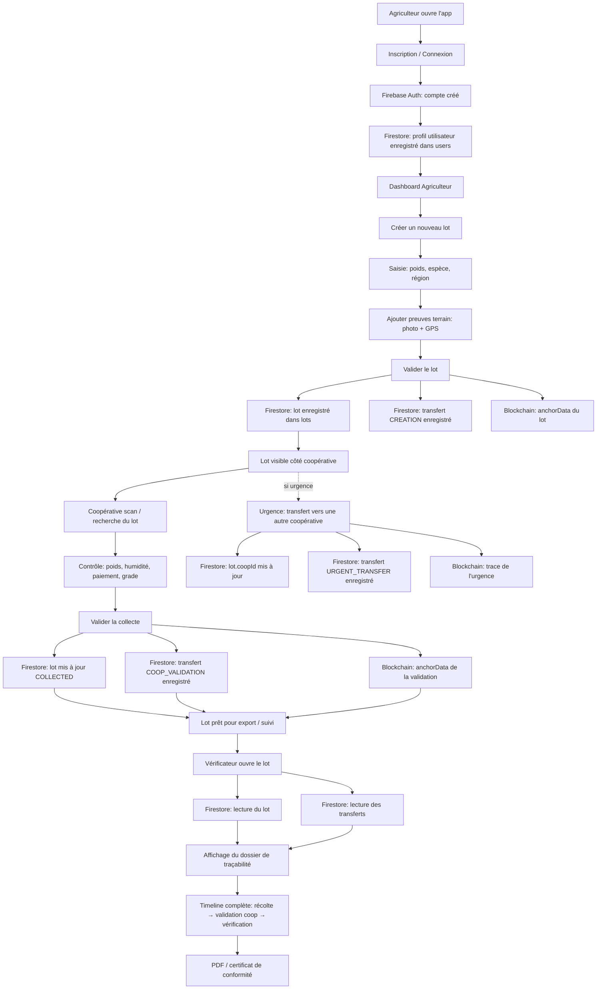

# Schéma du flux: inscription agriculteur → vérification chez le vérificateur

## Résumé fonctionnel
- **Inscription / connexion**: Firebase Auth crée le compte, Firestore sauvegarde le profil.
- **Agriculteur**: crée le lot avec photo et GPS, puis le lot est enregistré en base et ancré sur la blockchain.
- **Coopérative**: scanne le lot, vérifie le poids et la qualité, puis valide la collecte.
- **Vérificateur**: lit le lot et toute la chaîne d'événements pour reconstruire la traçabilité complète.
- **Urgence**: si la coopérative d'origine est indisponible, le lot peut être transféré vers une autre coopérative.

## Données persistées
- `users` : profils des utilisateurs.
- `lots` : lots de cacao.
- `lots/{lotId}/transfers` : historique des événements du lot.
- **Blockchain** : hash de création, de validation et d'urgence.
